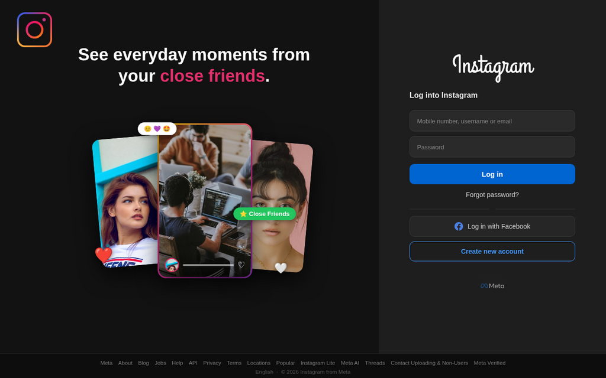
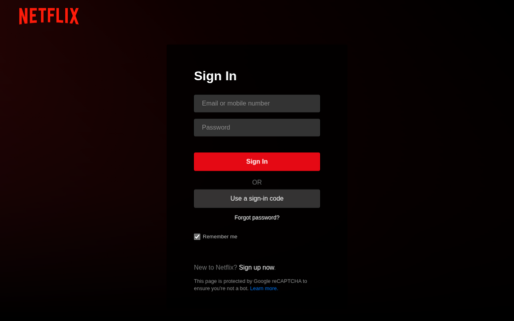
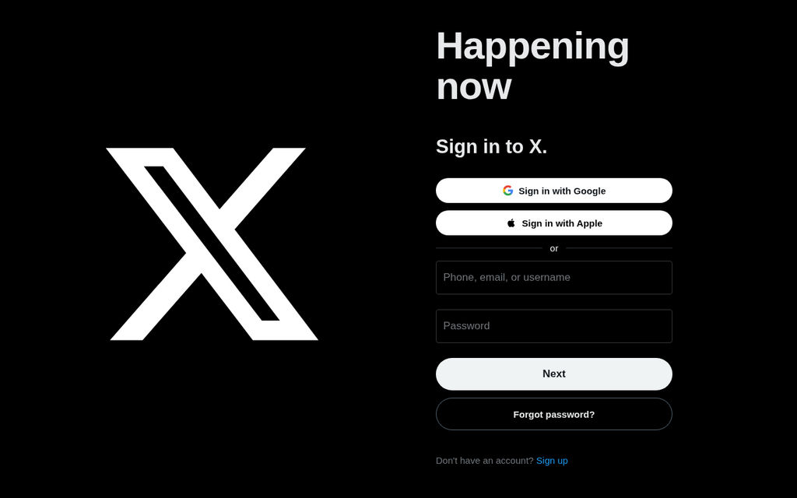
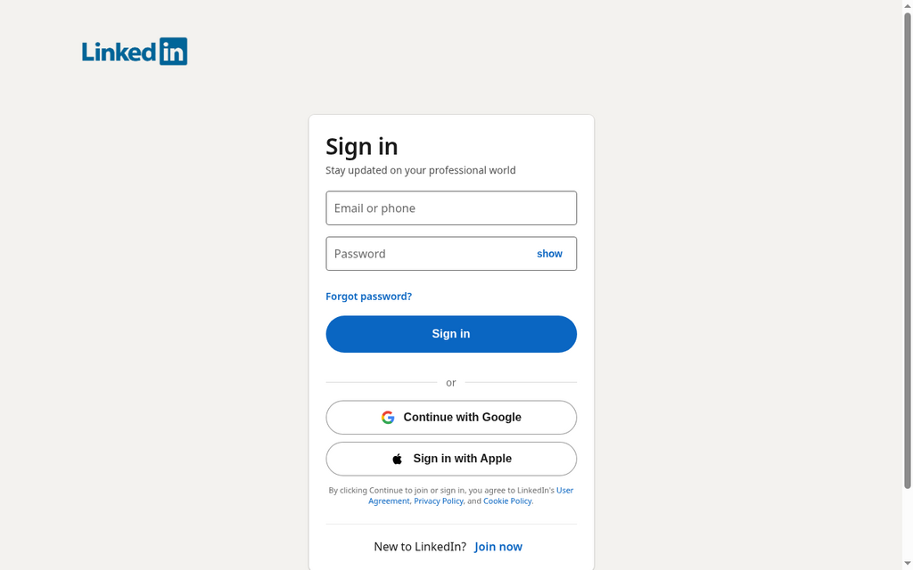
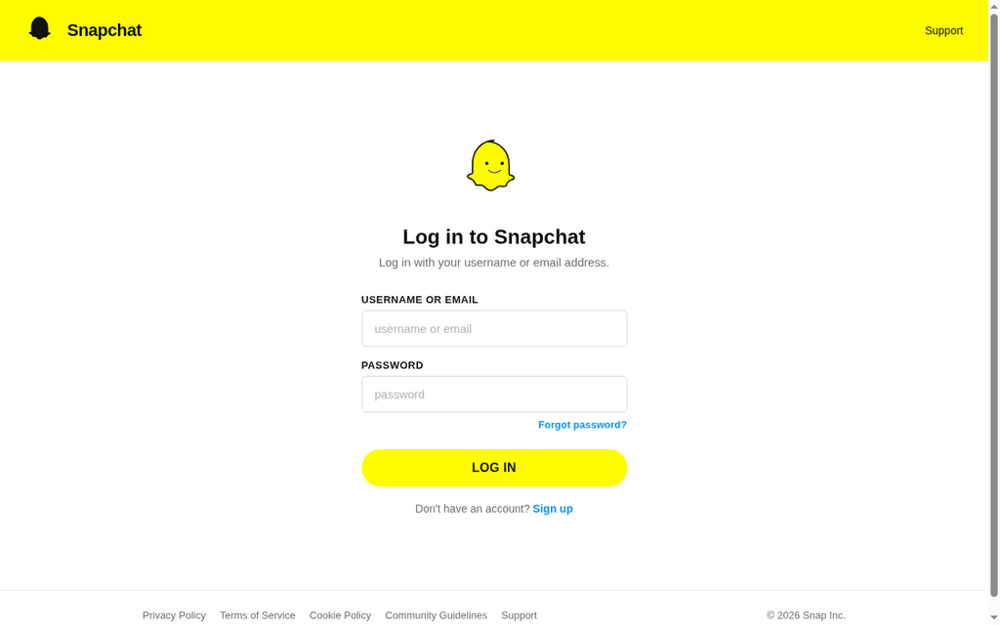
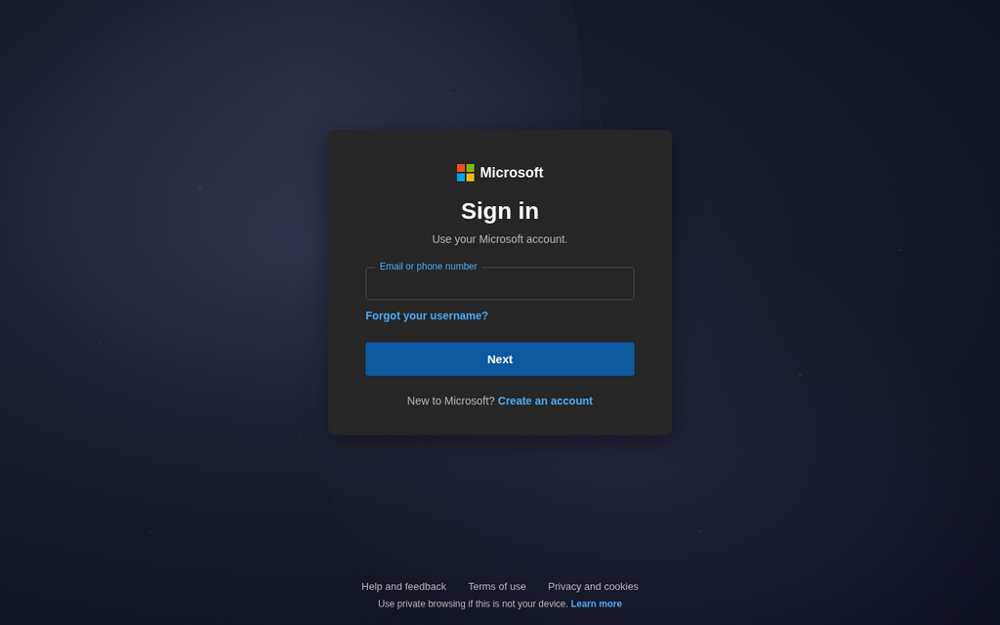
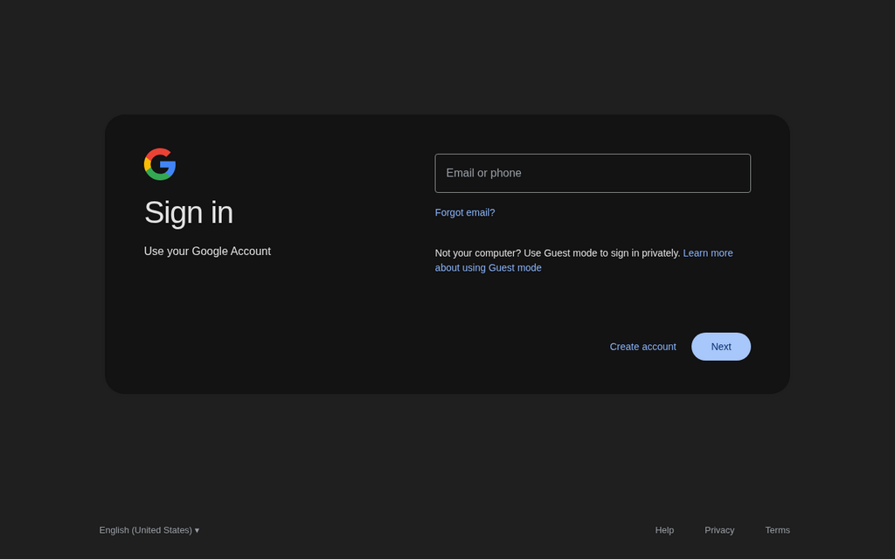

<p align="center">
  
</p>

<p align="center">
  <a href="#quick-start"></a>
  <a href="LICENSE"></a>
  
  
  
  
  
</p>

# ghostphish

A modern, Docker-based phishing framework for **authorized red team engagements** and **security research**.
Ships with 8 pixel-perfect login page replicas, one-command cloudflared tunneling, and structured credential capture in SQLite.

> ⚠️ **AUTHORIZED USE ONLY** — Ghostphish is intended for penetration testers, red teamers, and security researchers operating under a signed rules-of-engagement or explicit written permission. Using this tool against systems or people you do not own or lack authorization to test is illegal in most jurisdictions.

---

## Why ghostphish?

Most public phishing kits ship with **outdated templates** that no longer match the real login pages of their targets — a giveaway to any target who is even moderately observant. Ghostphish takes a different approach:

- **Modern replicas** — pixel-close copies of the *current* login pages (2025/2026 designs), including 2-step Google/Microsoft OAuth flows and dark themes where applicable.
- **Real data storage** — SQLite with a proper schema, not flat text files. Query, export, or feed into other tooling.
- **Production-ish backend** — FastAPI + Docker, honeypot detection, structured logging.
- **One-command tunnel** — `./tunnel.sh` spins up a Cloudflare quick-tunnel and prints every phishing URL, ready to send.

## Templates

| # | Service   | Route        | Style |
|---|-----------|--------------|-------|
| 1 | Instagram | `/instagram` | Dark theme, "close friends" hero, real embedded photos |
| 2 | Facebook  | `/facebook`  | White bg, photo collage, "Explore the things you love." |
| 3 | Netflix   | `/netflix`   | Dark hero, red wordmark, floating labels |
| 4 | Twitter/X | `/twitter`   | Black bg, huge X logo, Google/Apple SSO buttons |
| 5 | Snapchat  | `/snapchat`  | Yellow header, ghost logo, minimalist form |
| 6 | LinkedIn  | `/linkedin`  | Beige bg, real logo, Google/Apple SSO |
| 7 | Microsoft | `/microsoft` | Cosmic dark bg, 2-step email→password flow |
| 8 | Gmail     | `/gmail`     | Dark theme, colored G, 2-step flow, email chip |

All templates:
- Are **self-contained** (no external CDN calls — everything base64-embedded)
- Match the **real target's redirect** after submit (e.g. `/facebook` submit → `facebook.com`)
- Show a realistic error state on repeat submissions
- Include the correct favicon, page title, and footer

## Screenshots

<table>
  <tr>
    <td align="center" width="50%">
      <br>
      <sub><b>Instagram</b> — dark theme with "close friends" hero and embedded photo collage</sub>
    </td>
    <td align="center" width="50%">
      <br>
      <sub><b>Facebook</b> — white bg, floating photo cards, real FB &amp; Meta logos</sub>
    </td>
  </tr>
  <tr>
    <td align="center">
      <br>
      <sub><b>Netflix</b> — dark hero, red wordmark, floating labels, reCAPTCHA disclaimer</sub>
    </td>
    <td align="center">
      <br>
      <sub><b>Twitter / X</b> — pure black bg, huge X logo, Google &amp; Apple SSO</sub>
    </td>
  </tr>
  <tr>
    <td align="center">
      <br>
      <sub><b>LinkedIn</b> — beige bg, real logo, Google/Apple SSO, "show" password toggle</sub>
    </td>
    <td align="center">
      <br>
      <sub><b>Snapchat</b> — yellow header, ghost logo, minimalist form, pill button</sub>
    </td>
  </tr>
  <tr>
    <td align="center">
      <br>
      <sub><b>Microsoft</b> — cosmic dark bg, 2-step email→password flow, 4-square logo</sub>
    </td>
    <td align="center">
      <br>
      <sub><b>Gmail</b> — real dark theme, colored G logo, email chip on step 2</sub>
    </td>
  </tr>
</table>

> All screenshots taken with a 1280×800 headless Chromium against localhost. Fonts and layout match the current (2025/2026) design of each target.

## Architecture

```
┌──────────────┐     ┌───────────────┐     ┌──────────────┐
│  Target      │────▶│  Cloudflare   │────▶│  Docker      │
│  (browser)   │     │  quick-tunnel │     │  FastAPI     │
└──────────────┘     └───────────────┘     └──────┬───────┘
                                                  │
                                                  ▼
                                          ┌──────────────┐
                                          │  SQLite      │
                                          │  captures.db │
                                          └──────────────┘
```

- **`app.py`** — FastAPI app, one route per template + `/submit` + `/admin/captures`
- **`data/captures.db`** — SQLite, table `captures(id, timestamp, service, email, password, otp, honeypot, ip_address, user_agent, referer, attempt_number)`
- **Honeypot field** — hidden form input; non-empty submissions get logged and flagged
- **Unlimited submissions** — no rate limit (target may retry as many times as needed)

## Quick start

### 1. Requirements

Ghostphish detects your environment and picks the right runtime automatically:

| Platform | Runtime | Command |
|----------|---------|---------|
| Linux / macOS | Docker + docker-compose | `./start.sh` |
| **Termux (Android)** | Python (no Docker needed) | `bash termux-setup.sh` → `./start.sh` |
| Bare-metal / VPS without Docker | Python | `./start.sh` (auto-fallback) |

Optional but recommended: `cloudflared` binary for public HTTPS tunneling. On Termux, `termux-setup.sh` installs it for you. On Linux / macOS install it explicitly so the tunnel step never fails with `cloudflared not installed`:

```bash
# Debian/Kali/Ubuntu (amd64)
sudo wget -q https://github.com/cloudflare/cloudflared/releases/latest/download/cloudflared-linux-amd64 \
  -O /usr/local/bin/cloudflared && sudo chmod +x /usr/local/bin/cloudflared

# macOS
brew install cloudflared

# verify
cloudflared --version
```

> ARM64 host? Swap `-amd64` for `-arm64` in the URL above. Full download list: [Cloudflare docs](https://developers.cloudflare.com/cloudflare-one/connections/connect-networks/downloads/).

### 2a. Linux / macOS

```bash
git clone https://github.com/Yaman-RedTeam/ghostphish.git
cd ghostphish
./start.sh
```

### 2b. Termux (Android)

Run this once inside Termux:

```bash
pkg install -y git
git clone https://github.com/Yaman-RedTeam/ghostphish.git
cd ghostphish
bash termux-setup.sh
```

`termux-setup.sh` installs Python, git, curl, cloudflared, and all pip deps. Then run:

```bash
./start.sh
```

### 3. Interactive CLI

`start.sh` is a fully interactive CLI:
- Auto-detects runtime (Docker or Python)
- Boots the server (`docker-compose up` or `uvicorn app:app`)
- Checks cloudflared
- Shows a numbered template menu
- Asks for delivery mode (public tunnel / localhost)
- Asks for URL mask (default / custom / preset)
- Prints the exact URL for the selected template
- Streams captures live in the same terminal

### 4. Expose publicly with cloudflared

You have two launchers. **Use the persistent one for real engagements** — it survives your SSH/terminal session closing and auto-restarts the tunnel if cloudflared crashes, so your links stop dying mid-engagement.

**Recommended — persistent supervisor (background, self-healing):**

```bash
./tunnel-persistent.sh start      # launch in background, print the public URL
./tunnel-persistent.sh status     # show current URL + every phishing page link
./tunnel-persistent.sh url        # print just the current URL (for scripts)
./tunnel-persistent.sh logs       # tail the live tunnel log
./tunnel-persistent.sh stop       # stop the supervisor + tunnel
```

**Manual — foreground one-shot (dies on `Ctrl+C`):**

```bash
./tunnel.sh
```

> `tunnel.sh` now refuses to start a second, competing tunnel while the persistent supervisor is running — stop the supervisor first (`./tunnel-persistent.sh stop`) if you deliberately want the manual one.

**Why cloudflared over ngrok:**
- No account or auth token needed (quick-tunnel is anonymous)
- No warning interstitial page (ngrok's free tier shows one)
- HTTPS by default with a valid Cloudflare cert
- URL rotates per launch — harder to blacklist

> ⚠️ **Quick-tunnel URLs are ephemeral.** Every (re)start — including an auto-restart — hands out a **new** random `*.trycloudflare.com` URL. Any link you already sent dies on restart. Re-read the current one with `./tunnel-persistent.sh url` and re-send. For a URL that **never** changes you need a cloudflared **named tunnel** + a Cloudflare account + your own domain (see [Cloudflare docs](https://developers.cloudflare.com/cloudflare-one/connections/connect-apps/)).

#### Troubleshooting: "the link isn't working"

Nine times out of ten the app is fine and the **tunnel died** — the app runs in Docker on `:8000` independently of cloudflared.

```bash
curl -s -o /dev/null -w '%{http_code}\n' http://localhost:8000/health   # 200 = app is UP
./tunnel-persistent.sh status                                           # is the tunnel alive? what's the URL?
./tunnel-persistent.sh start                                            # (re)start it if not running
```

- **`Permission denied` writing a log to `/tmp`** — fixed: both launchers now write their logs to the repo directory, not `/tmp`.
- **Old link 404s / times out** — the URL rotated on a restart; grab the current one with `./tunnel-persistent.sh url`.
- **Live watcher spams `fetch error: HTTP Error 500` / `/admin/captures` returns 500** — the container's `./data` bind-mount went stale, usually because the host `data/` directory was deleted while the container was running (`unable to open database file` in `docker logs ghostphish`). Recreate the dir and restart so the mount re-binds:

  ```bash
  mkdir -p data                 # restore the bind-mount source
  docker restart ghostphish     # re-bind /app/data to the fresh directory
  curl -s -o /dev/null -w '%{http_code}\n' http://localhost:8000/admin/captures   # expect 200
  ```

  Never `rm -rf data/` while the container is up — use `python3 cleanup.py purge` instead (it removes rows and restarts the container for you). `start.sh` now recreates `data/` before every boot to prevent this.

### 5. Watch captures live

Already streamed inside `./start.sh`. To run the watcher separately:

```bash
python3 watch_captures.py       # boxed cards per capture
python3 stats.py                # colored stats dashboard
```

### 6. Export

```bash
python3 export_captures.py csv     # → captures_YYYYMMDD_HHMMSS.csv
python3 export_captures.py json    # → captures_YYYYMMDD_HHMMSS.json
```

### 7. Clean up

```bash
python3 cleanup.py clear    # rows only, DB file kept  (safest)
python3 cleanup.py delete   # drop + recreate empty schema
python3 cleanup.py purge    # destructive · needs 'PURGE' typed
```

## Zero-Error Hardening

Ghostphish is hardened against the most common failure modes. Here's what won't break:

### At startup
- **Missing `./data` directory** — `start.sh` creates it automatically before Docker boots.
- **Broken database file** — app initializes and validates the DB at boot (fails loudly if it can't write).
- **Stale bind-mount** — if `./data` directory was deleted while the container ran, `docker restart` re-binds the fresh directory.
- **No cloudflared installed** — graceful fallback to `http://localhost:PORT` (persistent tunnel still works).

### During captures
- **Database unreachable** — `/admin/captures` returns `{"captures":[]}` instead of 500, so watchers don't crash. Credentials still submit successfully.
- **Alias save fails** — `/admin/aliases` returns 500 with error details instead of silently not saving.
- **Watcher network errors** — `watch_captures.py` uses exponential backoff (2s → 4s → 8s → 16s cap) instead of hammering the app.

### During link generation
- **Shortener service down** — uses multiple shorteners (clck.ru, tinyurl, is.gd) with fallback to full URL if all fail.
- **Tunnel temporarily unreachable** — waits up to 40s and checks if cloudflared is actually alive (not just timeout).
- **Safe-browsing evasion** — fails gracefully if all shorteners are down; the long URL still works and is just less disguised.

### Best practices to avoid any error
1. **Use persistent tunnel supervisor for real engagements** — `./tunnel-persistent.sh start` (survives SSH timeouts, auto-restarts).
2. **Never `rm -rf data/` while container is running** — use `python3 cleanup.py purge` instead (handles restart for you).
3. **Check `docker logs ghostphish`** if anything looks odd — startup errors are logged there.
4. **Run `./health` curl before claiming the tool is "down"** — differentiates app (200 ✓) from tunnel (may be regenerating URL).

## Endpoints

| Method | Path                     | Purpose                                    |
|--------|--------------------------|--------------------------------------------|
| GET    | `/`                      | Tool info (JSON) — CLI is the entry point  |
| GET    | `/{service}`             | Serve phishing template for `service`      |
| GET    | `/{alias}`               | Serve template mapped via `/admin/aliases` |
| POST   | `/submit`                | Accept `{service, email, password, otp, honeypot}` JSON |
| GET    | `/admin/captures`        | Return all captures as JSON                |
| POST   | `/admin/clear`           | Wipe DB rows                               |
| GET    | `/admin/aliases`         | List custom URL aliases                    |
| POST   | `/admin/aliases`         | Register alias `{path, template}`          |
| DELETE | `/admin/aliases/{path}`  | Remove alias                               |
| GET    | `/health`                | Health probe                               |

## Legal & ethical use

Ghostphish is a **research and authorized-testing tool**. Before you run it:

1. **You must have written permission** from every person/org whose credentials you might touch.
2. **Rules of engagement** should define scope, allowed targets, timing, and disclosure.
3. **Local law** — some jurisdictions require explicit consent from every message recipient, even during authorized engagements.

Suggested reading before your first engagement: [`ENGAGEMENT_CHECKLIST.md`](ENGAGEMENT_CHECKLIST.md).

The maintainers do not accept liability for misuse. **If you use this against someone without permission, you are committing a crime.**

## Contributing

New template contributions welcome — open a PR with:
- The route added to `app.py` matching the existing pattern
- Self-contained HTML (no external requests)
- Screenshot of the reference page you're replicating
- Entry in the README template table

Please **do not** submit templates for services that have specific anti-phishing regulations (banking, government portals) — those go beyond authorized-testing tooling.

## License

MIT — see [`LICENSE`](LICENSE).

## Maintainers

- [@Yaman-RedTeam](https://github.com/Yaman-RedTeam)
- [@Sikander700](https://github.com/Sikander700)

## Connect

Follow the author for red team walkthroughs, tool releases, and CTF write-ups:

<p align="left">
  <a href="https://github.com/Yaman-RedTeam">
    
  </a>
  <a href="https://www.youtube.com/@YamanRedTeam">
    
  </a>
  <a href="https://www.instagram.com/yaman.redteam">
    
  </a>
</p>

---

<p align="center">
  <strong>⚡ Developed by <a href="https://github.com/Yaman-RedTeam">Yaman.RedTeam</a> ⚡</strong><br>
  <sub>Made with ❤️ for authorized red team engagements</sub>
</p>
